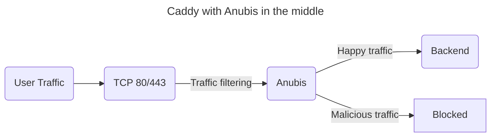

# Caddy

To use Anubis with Caddy, stick Anubis between Caddy and your backend. For example, consider this application setup:



Instead of your traffic going directly to your backend, it takes a detour through Anubis. Anubis filters out the "bad" traffic and passes the "good" traffic to the backend.

To set up Anubis with Docker compose and Caddy, start with a `docker-compose` configuration like this:

```yaml
services:
  caddy:
    image: caddy:2
    ports:
      - 80:80
      - 443:443
      - 443:443/udp
    volumes:
      - ./conf:/etc/caddy
      - caddy_config:/config
      - caddy_data:/data

  anubis:
    image: ghcr.io/techarohq/anubis:latest
    pull_policy: always
    environment:
      BIND: ":3000"
      TARGET: http://httpdebug:3000

  httpdebug:
    image: ghcr.io/xe/x/httpdebug
    pull_policy: always

volumes:
  caddy_data:
  caddy_config:
```

And then put the following in `conf/Caddyfile`:

```Caddyfile
# conf/Caddyfile

yourdomain.example.com {
  tls your@email.address

  reverse_proxy http://anubis:3000 {
		header_up X-Real-Ip {remote_host}
		header_up X-Http-Version {http.request.proto}
	}
}
```

If you want to protect multiple services with Anubis, you will need to either start multiple instances of Anubis (Anubis requires less than 32 MB of ram on average) or set up a two-tier routing setup where TLS termination is done with one instance of Caddy and the actual routing to services is done with another instance of Caddy. See the [nginx](./nginx.mdx) or [Apache](./apache.mdx) documentation to get ideas on how you would do this.
