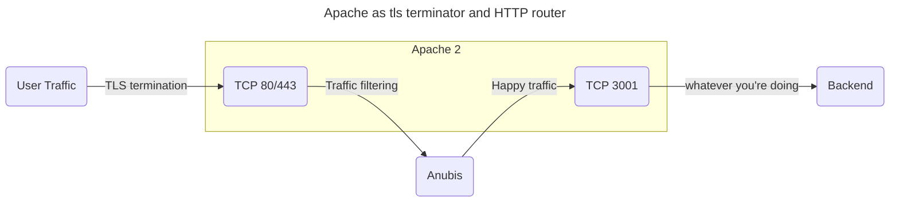

# Wordpress

Wordpress is the most popular blog engine on the planet.

## Using a multi-site setup with Anubis

If you have a multi-site setup where traffic goes through Anubis like this:



Wordpress may not realize that the underlying connection is being done over HTTPS. This could lead to a redirect loop in the `/wp-admin/` routes. In order to fix this, add the following to your `wp-config.php` file:

```php
if (isset($_SERVER['HTTP_X_FORWARDED_PROTO']) && $_SERVER['HTTP_X_FORWARDED_PROTO'] === 'https') {
    $_SERVER['HTTPS'] = 'on';
    $_SERVER['SERVER_PORT'] = 443;
}
```

This will make Wordpress think that your connection is over HTTPS instead of plain HTTP.
